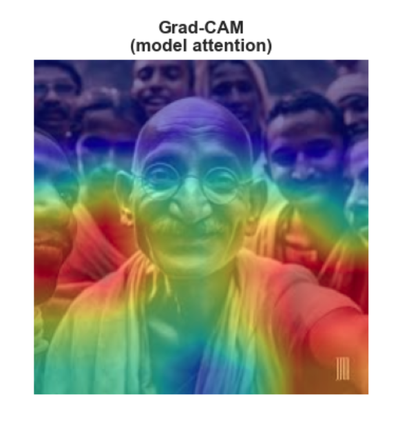
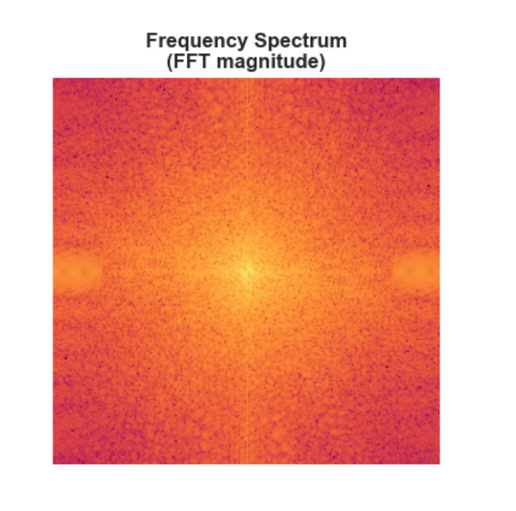
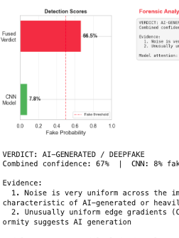
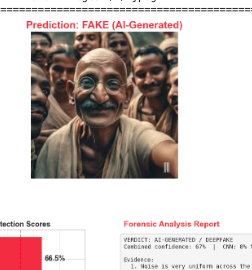
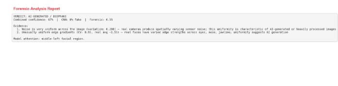
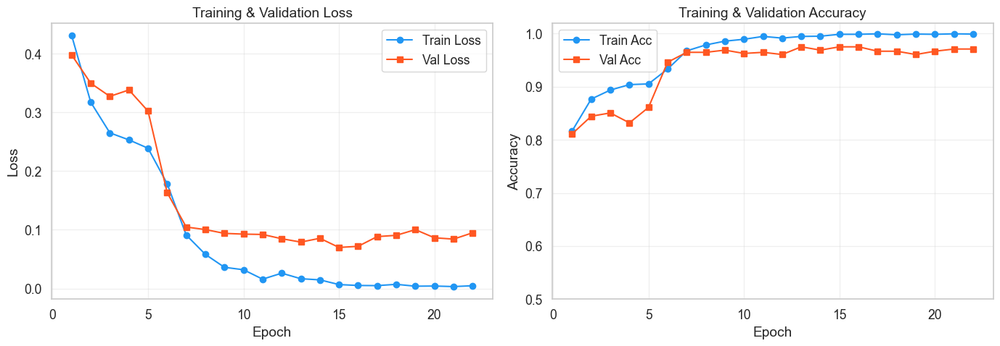
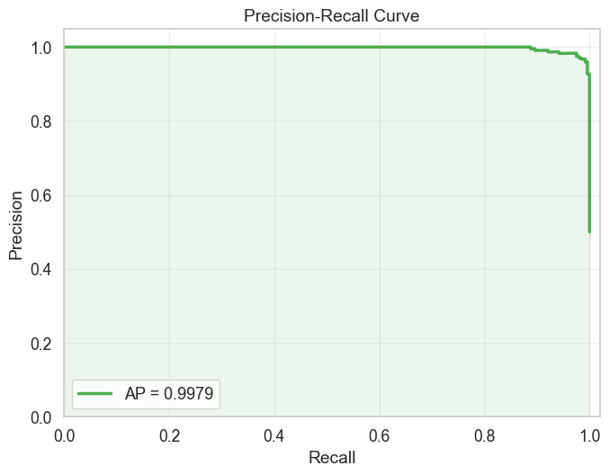
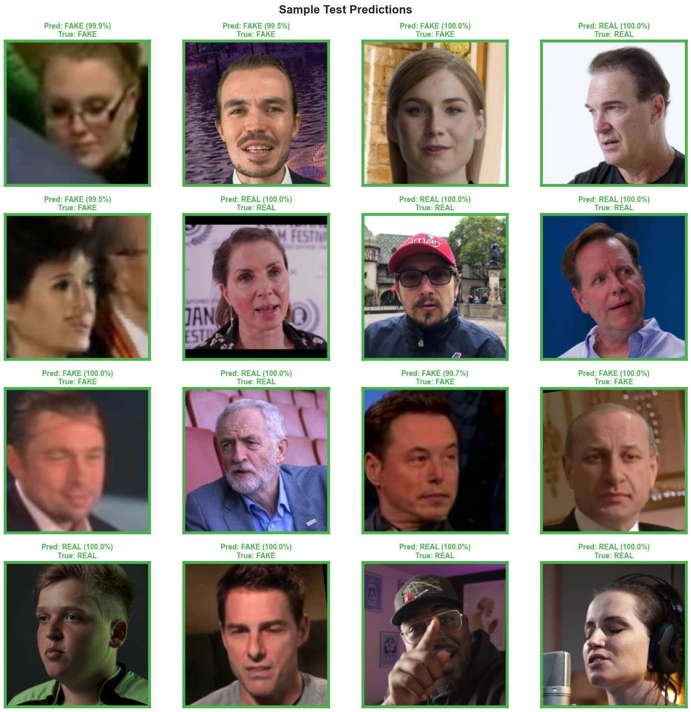

# DeepGuard: Deepfake Face Image Detector

A Jupyter notebook that trains an **EfficientNet-B0** based binary classifier to distinguish real human face photographs from AI-generated/deepfake faces, with **explainable forensic analysis** for each prediction.

## Features

- **Transfer learning** from ImageNet-pretrained EfficientNet-B0
- **Two-phase training**: frozen backbone warm-up, then full fine-tuning with early stopping
- **Explainable analysis**: Grad-CAM heatmaps, frequency spectrum (FFT), and forensic evidence
- **Fused detection**: combines CNN predictions with handcrafted forensic cues (noise uniformity, texture complexity, edge gradients, symmetry)
- Supports **CUDA**, **MPS** (Apple Silicon), and **CPU**

## Example Output

### Full Forensic Analysis

### Grad-CAM (Model Attention)

### Frequency Spectrum (FFT)

### Detection Scores

### Input Image & Forensic Report

In this example, the model classifies an AI-generated image as **FAKE** (66.5% fused verdict). The forensic analysis explains why:
- Noise is very uniform across the image — characteristic of AI-generated content
- Edge gradients are unusually uniform — real faces show more variation across eyes, nose, jawline

## Training Outputs

## Getting Started

### Prerequisites

- Python 3.10+
- PyTorch, torchvision, timm, scikit-learn, matplotlib, seaborn, Pillow, ipywidgets, opencv-python

### Setup

pip install torch torchvision timm scikit-learn seaborn matplotlib pillow ipywidgets opencv-python
